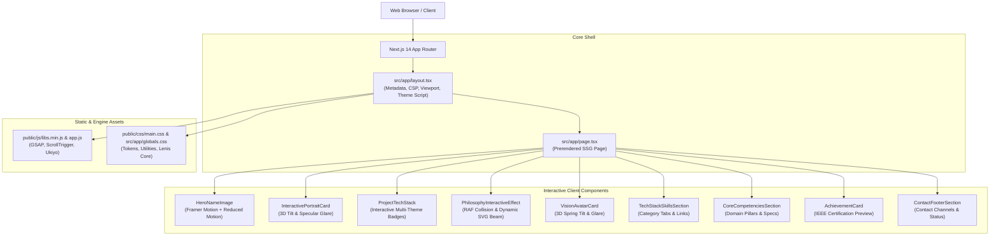

# Arnav Singh — Portfolio Website

> **Full-Stack AI Engineer & Systems Architect**  
> Computer Science Undergraduate @ Chandigarh University  
> Architecting distributed autonomous agent runtimes, real-time engines, and high-performance intelligent platforms where verifiable correctness takes precedence over hallucination.

[](https://nextjs.org/)
[](https://www.typescriptlang.org/)
[](https://react.dev/)
[](https://www.framer.com/motion/)

---

## ⚡ 1. Project Overview

A production-grade personal portfolio website showcasing real-world full-stack and AI engineering systems. Built with **Next.js 14 (App Router)** and **TypeScript**, the site pairs high-precision editorial typography and interactive physics with rigorous engineering principles:
- **Warm Editorial Cream Palette:** `#faf7f0` primary canvas, `#e4e9df` secondary layer tokens, `#b07d2b` amber highlights, and obsidian card surfaces for high contrast.
- **Micro-Interaction Physics:** 3D perspective mouse tracking, specular radial glare shaders, dynamic SVG light-beam collision detection, and Framer Motion spring-dampened reveals.
- **Accessible & Motion-Aware:** Full `prefers-reduced-motion` compliance, `:focus-visible` keyboard focus indicators, and semantic HTML5 structures.

---

## 🌟 2. Key Highlights & Showcase Projects

1. **[NeuroSense](https://neurosense-orcin.vercel.app/)** — AI-Powered Neural Signal Analysis Platform
   - High-throughput neural telemetry processing with interactive visualizations, automated benchmark dashboards, and explainable feature attributions.
   - *Stack:* Next.js, TypeScript, Tailwind CSS, Python / FastAPI, WebSockets.

2. **[CLUDE](https://frontend-mu-roan-llgeruknl5.vercel.app/)** — Autonomous Production Incident Root-Cause Engine
   - Synthesizes multi-file git diffs against runtime stack traces in < 8s using Tree-sitter AST syntax chunking and Claude 3.5 Sonnet.
   - *Stack:* FastAPI, Next.js 14, PostgreSQL 16 + pgvector HNSW, Celery + Redis, Docker.

3. **[IGNITE](https://ignite-lemon-nu.vercel.app/)** — Dynamic Tourist Safety & Pan-India GIS Routing
   - Telemetry fusion across Indian Meteorological Department (IMD) sensors, 6 environmental disaster zones, and altitude sickness (AMS) curves.
   - *Stack:* FastAPI, React 19 + Vite, Leaflet.js, Deterministic Risk AST.

4. **[SIRUS](https://web-frontend-three-gamma.vercel.app/)** — Multi-Tenant Algorithmic Trading Platform
   - Direct Market Access with a 540,000 ticks/sec vectorized backtesting engine, AES-256 encrypted demat vaults, and Redis Streams event queues.
   - *Stack:* Next.js 14, Three.js, Python FastAPI, Redis Streams, Pandas.

5. **[IEEE Idea2Impact 2026](file:///c:/Users/arnav/OneDrive/Desktop/PORTFOLIO/public/img/achievements/ieee-idea2impact-cert.pdf)**
   - Top 15 Finalist Team (Team Digital Destroyer) recognized at the national-level innovation challenge by the IEEE Computational Intelligence Society.

---

## 🏗️ 3. Architecture



---

## 📁 4. Clean Folder Structure

```
PORTFOLIO/
├── public/                       # Static public assets
│   ├── css/                      # Template base styles and vendor plugins
│   ├── img/                      # Optimized image assets
│   │   ├── achievements/         # IEEE certificate previews and PDFs
│   │   ├── competencies/         # 3D illustration assets
│   │   ├── dividers/             # Philosophy visual dividers
│   │   ├── favicon/              # App favicons and touch icons
│   │   ├── illustrations/        # Interactive card portraits & sketches
│   │   └── works/showcase-stack/ # NeuroSense, CLUDE, IGNITE, SIRUS screenshots
│   ├── js/                       # GSAP and interaction engine bundles
│   ├── arnav-cutout.png          # High-resolution cut-out asset
│   ├── hero-name.png             # Hero display title asset
│   └── resume.pdf                # Current curriculum vitae
├── src/
│   ├── app/
│   │   ├── fonts/                # Local fallback font binaries
│   │   ├── favicon.ico           # Fallback browser favicon
│   │   ├── globals.css           # Global design tokens and reset styles
│   │   ├── layout.tsx            # Root layout with SEO and metadata
│   │   └── page.tsx              # Main portfolio landing page
│   ├── components/               # Clean, modular React client components
│   │   ├── AchievementCard.tsx
│   │   ├── ContactFooterSection.tsx
│   │   ├── CoreCompetenciesSection.tsx
│   │   ├── Footer.tsx
│   │   ├── HeroNameImage.tsx
│   │   ├── InteractivePortraitCard.tsx
│   │   ├── PhilosophyInteractiveEffect.tsx
│   │   ├── ProjectTechStack.tsx
│   │   ├── SocialIcons.tsx
│   │   ├── TechStackSkillsSection.tsx
│   │   └── VisionAvatarCard.tsx
│   └── lib/
│       └── motion.ts             # Quintic easing and motion tokens
├── next.config.mjs               # Production security headers and config
├── package.json                  # Dependency manifest
├── tsconfig.json                 # TypeScript compiler options
└── README.md                     # Architecture and developer handbook
```

---

## 🚀 5. Local Development Setup

### Prerequisites
- **Node.js**: `18.17.0+` or `20.x`
- **Package Manager**: `npm` (v10+)

### Quickstart
```bash
# 1. Clone repository
git clone https://github.com/arnnnnaaavvvvv/PORTFOLIO.git
cd PORTFOLIO

# 2. Install dependencies
npm install

# 3. Start local development server
npm run dev
```

Open [http://localhost:3000](http://localhost:3000) to inspect the site.

---

## 🔒 6. Security Architecture

1. **HTTP Security Headers**: Configured via `next.config.mjs` for all incoming routes:
   - `X-Frame-Options: SAMEORIGIN` (prevents clickjacking attacks)
   - `X-Content-Type-Options: nosniff` (mitigates MIME-confusion attacks)
   - `Referrer-Policy: strict-origin-when-cross-origin` (prevents credential leakage in referrer headers)
   - `Permissions-Policy: camera=(), microphone=(), geolocation=(), browsing-topics=()`
   - `Strict-Transport-Security: max-age=63072000; includeSubDomains; preload` (enforces HSTS)
2. **Fingerprint Concealment**: `poweredByHeader: false` suppresses the `X-Powered-By: Next.js` header.
3. **External Link Defense**: All outbound anchor elements with `target="_blank"` strictly implement `rel="noopener noreferrer"` to protect against tabnabbing and window manipulation.
4. **Zero Client Secrets**: No API keys, cloud tokens, or database credentials exist in source code or client-side bundles.

---

## 🛠️ 7. Available Scripts

| Command | Description |
| :--- | :--- |
| `npm run dev` | Runs the Next.js development server on `localhost:3000` |
| `npm run build` | Compiles an optimized, typechecked production static bundle |
| `npm run start` | Boots the Next.js production server from `.next` |
| `npm run lint` | Runs Next.js ESLint diagnostics |
| `npx tsc --noEmit` | Validates TypeScript types across the entire codebase |

---

## 📜 8. Important Architectural Decisions

- **Selective Client Components**: The Next.js App Router serves the shell statically (`○ Static prerendered`) while delegating isolated micro-animations to Client Components (`"use client"`), minimizing client JS execution to 63 kB for the home route.
- **Hardware Acceleration**: Card tilting and specular glow computations strictly bind to `transform: perspective(...) rotateX(...) rotateY(...)` and CSS custom variables to bypass CPU repaint cycles.
- **Single Source of Truth for Motion**: Shared animation curves are centralized in `src/lib/motion.ts` using the quintic curve `[0.16, 1, 0.3, 1]`.

---

## 📬 Contact & Connect

- **Email:** [arnav152007@gmail.com](mailto:arnav152007@gmail.com)
- **LinkedIn:** [in/arnav-singh-986722252](https://www.linkedin.com/in/arnav-singh-986722252)
- **GitHub:** [@arnnnnaaavvvvv](https://github.com/arnnnnaaavvvvv)

Designed & Architected by **Arnav Singh** · B.Tech CSE @ Chandigarh University
